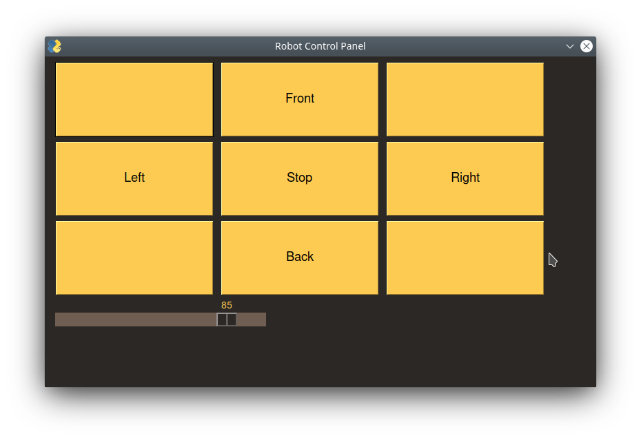

# PI Robot

* Robot - Gets commands, runs them
* GUI - Window to Control the robot

# Install

Require:
* Venv (Simon Only)
    * python3 -m venv build_virtual_env
    * Makes a virtual folder called build_virtual_env
* sudo apt-get install python3-tk
* cd GUI
* pip install -r requirements.txt
* sudo apt-get install i2c-tools
* sudo apt-get install python3-smbus

# Run

* cd GUI 
* python3 main.py

* cd Robot
* python3 main.py
